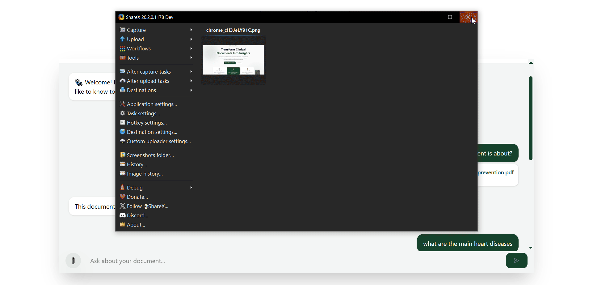
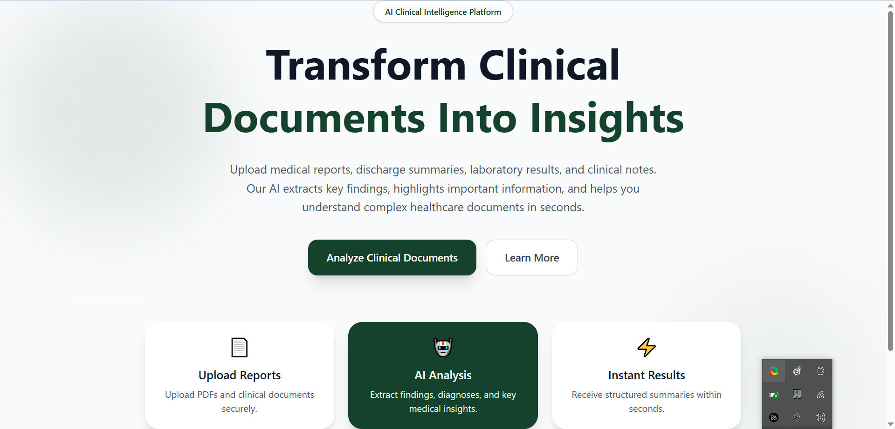

<div align="center" style="max-width:1000px;margin:auto;">

<h1 style="margin-bottom:8px;">🩺 AI Powered Medical Assistant</h1>

<p style="font-size:16px;">
An AI-powered application that helps users understand complex medical reports through
<strong>Retrieval-Augmented Generation (RAG)</strong>. Upload a report, ask questions,
and receive accurate, easy-to-understand explanations powered by AI.
</p>



<br><br>


</div>

---

##  About

AI Powered Medical Assistant is designed to make medical reports easier to understand for everyone.

The application uses **React**, **Tailwind CSS**, **FastAPI**, **LangChain**, and **Pinecone** to build a **Retrieval-Augmented Generation (RAG)** pipeline that retrieves relevant medical context before generating AI responses.

---

##  Preview

<p align="center">

</p>

---

##  Features

-  Upload medical reports
-  AI-powered report explanation
-  Ask questions about uploaded documents
-  Retrieval-Augmented Generation (RAG)
-  Semantic search using Pinecone
-  FastAPI backend
-  Responsive React + Tailwind UI
-  Secure environment variables

---

##  Tech Stack

| Frontend | Backend | AI |
|-----------|----------|-----|
| React | FastAPI | LangChain |
| Tailwind CSS | Python | Pinecone |
| JavaScript | REST API | RAG |

---

##  Installation

### Clone Repository

```bash
git clone https://github.com/Orakzai-Dev3/Ai-powered-medical-assistat.git
```

### Backend

```bash
cd server
uv sync
uv run uvicorn main:app --reload
```

### Frontend

```bash
cd my-project
npm install
npm run dev
```

---

##  Environment Variables

```env
GROQ_API_KEY=YOUR_API_KEY
GOOGLE_API_KEY=YOUR_API_KEY
PINECONE_API_KEY=YOUR_API_KEY
PINECONE_INDEX_NAME=YOUR_INDEX_NAME
```

---

##  Support

If you found this project useful, consider giving it a **Star** on GitHub.

---

<div align="center">

### Built with ❤️ using React, Tailwind CSS, FastAPI, LangChain & Pinecone

</div>


